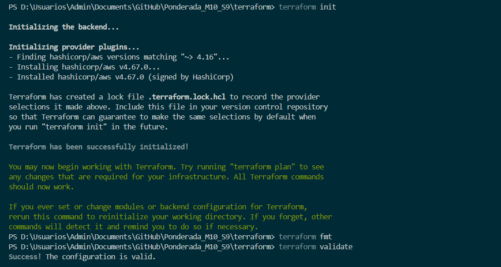
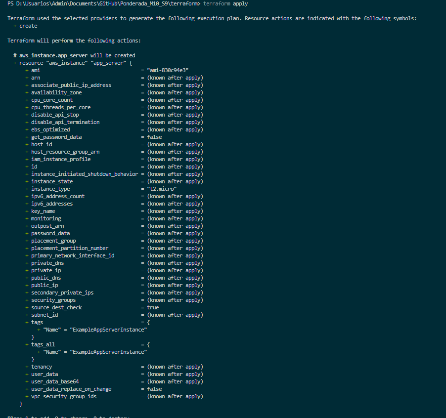
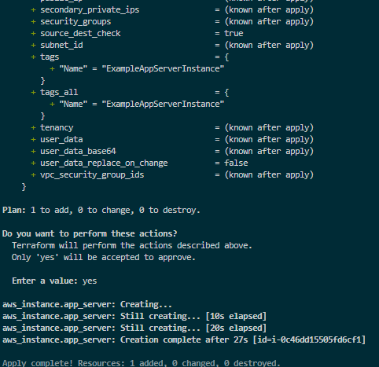

# Ponderada_M10_S9

# Introdução:
Esse é um passo a passo de como fazer um deploy de uma EC2 usando do Terraform

## Configurar Ambiente de desenvolvimento

- Instalar - AWS CLI:
  
Basta seguir o passo a passo desse site:
https://docs.aws.amazon.com/cli/latest/userguide/getting-started-install.html

- Instalar - Terraform:
  
https://developer.hashicorp.com/terraform/tutorials/aws-get-started/install-cli
OBS: Para esse passo é nescessario você ter baixado o choco no seu computador 

## Configurar o AWS CLI:
- Após instalar o AWS CLI, é nescessario rodar o seguinte comando:
```aws configure```

Após rodar esse comando sera solicitado as seguintes credenciais da AWS, Access Key ID, Secret Access Key, região padrão e formato de saída padrão, essas informações são disponibilizadas na plataforma da AWS.

- Agora é nescessario rodar o seguinte comando:
```    aws configure set aws_session_token SEUSESSIONTOKENAQUI```

basta substituir o 'SEUSESSIONTOKENAQUI' pelo seu Session Token.

## Configurar o terraform:
Deve ser criado o seguinte arquivo em seu código:
```
terraform {
        required_providers {
            aws = {
            source  = "hashicorp/aws"
            version = "~> 4.16"
            }
        }

        required_version = ">= 1.2.0"
        }

        provider "aws" {
        region = "us-east-1"
        }

        resource "aws_instance" "app_server" {
        ami           = "ami-830c94e3"
        instance_type = "t2.micro"

        tags = {
            Name = "ExampleAppServerInstance"
        }
    }
```
Chame o arquivo acima de main.tf

-  inicialize um diretorio de trabalho do Terraform, com o seguinte comando:

``` terraform init ```

- Formate o código do Terraform de acordo com as convenções de estilo recomendadas pelo Terraform, usando do comando:

``` terraform fmt ```

- Valide a sintaxe e a semântica do código do Terraform, com esse comando:

```terraform validate```

</img>

- Crie um plano de execução do Terraform, usando o comando:

  ```terraform plan```

  
 </img>

 ## EC2 rodando na AWS:

Abrindo o console da AWS e entrando na aba de "EC2" é possivel ver sua EC2 ativa:
</img>

